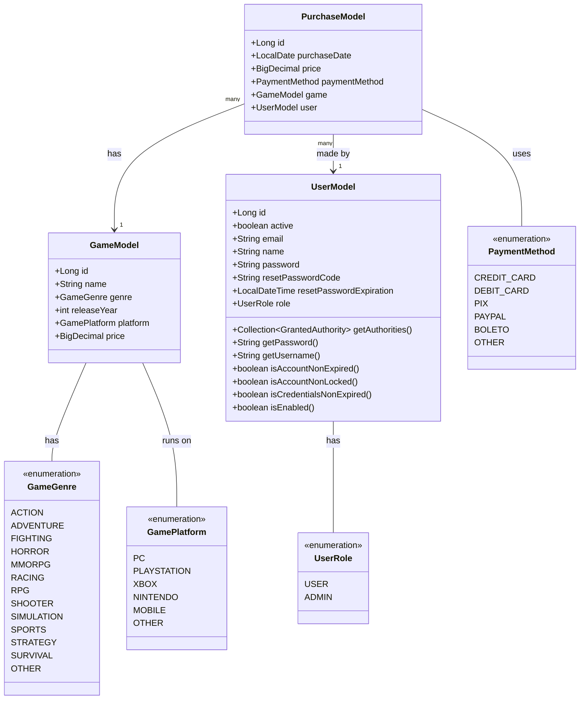

<div align="center">
  
  <h1 align="center">Ludus Game Store API</h1>
  
  [](https://spring.io/projects/spring-boot)
  [](https://www.oracle.com/java/)
  [](https://junit.org/junit5/)
  [](https://site.mockito.org/)
  [](https://www.docker.com/)
  [](LICENSE)
  [](http://localhost:8080/swagger-ui.html)
  
  [](https://git.io/typing-svg)
  
  <h3>A comprehensive RESTful API for managing a modern gaming store platform with secure user authentication, robust game catalog, and seamless purchase processing.</h3>
</div>

## 📋 Table of Contents

- [📌 Overview](#-overview)
- [✨ Key Features](#-key-features)
- [🛠️ Tech Stack](#️-tech-stack)
- [🚀 Getting Started](#-getting-started)
- [📊 API Endpoints](#-api-endpoints)
- [🔐 Security Implementation](#-security-implementation)
- [📝 Data Models](#-data-models)
- [🧪 Testing Strategy](#-testing-strategy)
- [🐳 Docker Support](#-docker-support)
- [👥 Credits](#-credits)
- [🤝 Contributing](#-contributing)
- [📜 License](#-license)

## 📌 Overview

Ludus Game Store API is a robust Spring Boot application that provides a complete backend solution for online game stores. The API enables developers to manage game catalogs, handle user authentication and authorization, process purchases with various payment methods, and implement filtering capabilities for an enhanced user experience.

## ✨ Key Features

- **Game Management**
  - Create, read, update, and delete games
  - Filter games by genre, platform, release year, and name
  - Comprehensive validation of game attributes
  
- **User Authentication & Authorization**
  - JWT-based authentication
  - Role-based access control
  - Secure password handling
  
- **Purchase Processing**
  - Multiple payment methods (Credit Card, Debit Card, PIX, PayPal, Boleto)
  - Purchase history tracking
  - User-specific purchase reports
  
- **Robust Error Handling**
  - Customized exception messages
  - Internationalization support
  - Validation error reporting
  
- **Pagination & Sorting**
  - Efficient data retrieval with pagination
  - Dynamic response format with metadata

## 🛠️ Tech Stack

- **Backend Framework**: Spring Boot
- **Security**: Spring Security with JWT
- **Database Access**: Spring Data JPA
- **API Documentation**: Swagger/OpenAPI
- **Validation**: Jakarta Bean Validation
- **Data Modeling**: Lombok
- **Testing**: JUnit 5, Mockito
- **Containerization**: Docker
- **Dependency Management**: Maven

## 🚀 Getting Started

### Prerequisites

- Java 21 or higher
- Maven 3.6+ 
- Your preferred IDE (IntelliJ IDEA, Eclipse, VS Code)
- MySQL Server or compatible database
- Docker (optional, for containerized deployment)

### Installation

1. Clone the repository:
```bash
git clone https://github.com/brunoliratm/Ludus-GameStore-Api.git
cd Ludus-GameStore-Api
```

2. Configure your database settings in `application.properties`
```properties
spring.datasource.url=jdbc:mysql://localhost:3306/ludus_db
spring.datasource.username=your_username
spring.datasource.password=your_password
```

3. Build the project:
```bash
mvn clean install
```

4. Run the application:
```bash
mvn spring-boot:run
```

5. Access the API at `http://localhost:8080/`
6. Explore API documentation at `http://localhost:8080/swagger-ui.html`

### Docker Deployment

1. Build the Docker image:
```bash
docker build -t ludus-gamestore-api .
```

2. Run the container:
```bash
docker run -p 8080:8080 -e SPRING_PROFILES_ACTIVE=prod ludus-gamestore-api
```

## 📊 API Endpoints

### Games API

| Method | Endpoint | Description |
|--------|----------|-------------|
| GET | `/api/games` | List all games with optional filtering by genre and name |
| GET | `/api/games/{id}` | Get game details by ID |
| POST | `/api/games` | Create a new game |
| PUT | `/api/games/{id}` | Update an existing game |
| PATCH | `/api/games/{id}` | Partially update a game |
| DELETE | `/api/games/{id}` | Delete a game |

### Users API

| Method | Endpoint | Description |
|--------|----------|-------------|
| POST | `/api/users` | Register a new user |
| GET | `/api/users/{id}` | Get user profile by ID |
| PUT | `/api/users/{id}` | Update user information |
| DELETE | `/api/users/{id}` | Delete user account |

### Authentication API

| Method | Endpoint | Description |
|--------|----------|-------------|
| POST | `/api/auth/login` | Authenticate user and get JWT token |
| POST | `/api/auth/refresh` | Refresh authentication token |

### Purchases API

| Method | Endpoint | Description |
|--------|----------|-------------|
| GET | `/api/purchases` | List all purchases with optional filtering by payment method |
| GET | `/api/purchases/{id}` | Get purchase details by ID |
| POST | `/api/purchases` | Create a new purchase |
| GET | `/api/purchases/user/{userId}` | Get purchases by user ID |

## 🔐 Security Implementation

The API uses JWT (JSON Web Token) for authentication. The `TokenService` generates and validates tokens, while Spring Security handles authorization based on user roles. To access protected endpoints, include a valid JWT token in the Authorization header:

```
Authorization: Bearer <your_jwt_token>
```

## 📝 Data Models



## 🧪 Testing Strategy

The project uses a comprehensive testing approach to ensure code quality and reliability:

- **Unit Testing**: JUnit 5 for testing individual components in isolation
- **Mocking**: Mockito for creating mock objects to simulate dependencies
- **Test Coverage**: Extensive test coverage across all services and controllers
- **Integration Tests**: Testing the interaction between different components

Key test classes:
- `GameServiceTest`: Tests for game operations including validation and filtering
- `UserServiceTest`: Tests for user management operations
- `PurchaseServiceTest`: Tests for purchase process and order management
- `AuthServiceTest`: Tests for authentication and token generation/validation

To run the tests:
```bash
mvn test
```

## 🐳 Docker Support

The application includes Docker support for easy deployment in any environment. The Dockerfile sets up the appropriate Java runtime environment and configures the application for production use.

### Dockerfile Features
- Multi-stage build for optimized image size
- Maven build in the first stage with Eclipse Temurin 21
- Slim JRE-based runtime image in the second stage
- Proper layer caching for faster builds
- Exposes port 8080 for the application

### Environment Variables
The application supports configuration through environment variables, which can be passed when running the Docker container. Spring Boot will automatically map these environment variables to application properties.

Common environment variables you can configure:

- `SPRING_DATASOURCE_URL`: JDBC URL for your database
- `SPRING_DATASOURCE_USERNAME`: Database username
- `SPRING_DATASOURCE_PASSWORD`: Database password
- `SPRING_PROFILES_ACTIVE`: Set to your desired Spring profile (default, dev, prod)
- `SERVER_PORT`: The port on which the application runs (default: 8080)
- `JWT_SECRET`: Secret key used for JWT token signing

Example of running with custom environment variables:

```bash
docker run -p 8080:8080 \
  -e SPRING_DATASOURCE_URL=jdbc:mysql://db-host:3306/ludus_db \
  -e SPRING_DATASOURCE_USERNAME=dbuser \
  -e SPRING_DATASOURCE_PASSWORD=dbpassword \
  -e SPRING_PROFILES_ACTIVE=prod \
  -e JWT_SECRET=your_secure_jwt_secret \
  ludus-gamestore-api
```

## 👥 Credits

| <a href="https://github.com/brunoliratm"><p>BrunoMagno</p></a> | <a href="https://github.com/Paulo-Araujo-Jr"><p>PauloAraujo</p></a> |
| --- | --- |

## 🤝 Contributing

We welcome contributions from the community! To contribute:

1. Fork the repository
2. Create your feature branch (`git checkout -b feature/amazing-feature`)
3. Commit your changes (`git commit -m 'Add some amazing feature'`)
4. Push to the branch (`git push origin feature/amazing-feature`)
5. Open a Pull Request

Please make sure your code follows the project's coding standards and includes appropriate tests.

## 📜 License

This project is licensed under the MIT License.

